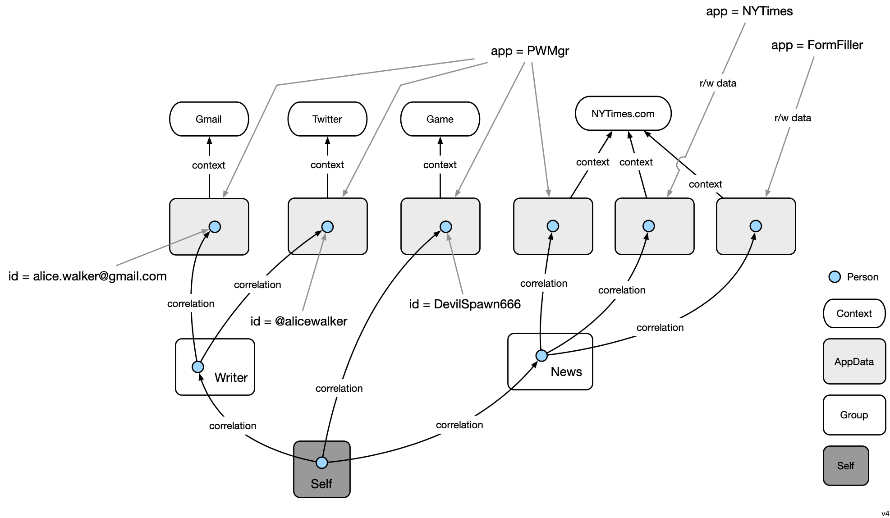

# Concepts

#### Selfness vs. Whoness

In his [last public speech](https://www.youtube.com/watch?v=9DExNTY3QAk) [Kim Cameron](https://en.wikipedia.org/wiki/Kim_Cameron_(computer_scientist)) introduced two useful definitions based on archaic English:

- **Selfness**: The sameness of a person or thing at all times or in all circumstances. The condition of being a single individual. The fact that a person or thing is itself and not something else. Individuality, personality. 
- **Whoness**: Who or what a person or thing is. A distinct impression of a single person or thing presented to or perceived by others. A set of characteristics or a description that distinguishes a person or thing from others. 

The following diagram illustrates these concepts and introduces the notion of context:

 

#### The Self and Contexts

The Mee privacy agent is a [digital twin](https://en.wikipedia.org/wiki/Digital_twin) of the user and represents both their selfness and whonesses.

The selfness of the user is represented by a data container called the *Self*. The contents of the Self are holistic and therefore quite sensitive. For this reason they would normally not be shared in a direct or comprehensive form with others. This Self abstraction is at the heart of what enables the Mee architecture to be a ""*meta*-identity system," as opposed to an identity system. The user's Self is the point of integration across contexts each of which may be from differing identity systems. 

Each context is represented by a *Context* data container. A directed *correlation* link points from the Self entity to the entity representing the self in each context. The only person who must know that in reality these contexts contain representations of the same self/user is *that* user. Each context may define its own identifier namespace, schemas, state management, communications protocols, UI, UX, etc. 

We can illustrate all of these concepts with a simple example. A user might have a gmail address, a Twitter handle, and in a game they play have the handle DevilSpawn666. Here's a simplified view of how this is represented:

### Privacy Agent

A privacy agent is a minimalist, occasional use application designed to handle administrative tasks related to managing the user’s personal data. It preserves the user's privacy when they are interacting with Mee-compatible apps and websites that have licensed the user's data according to the terms of the Mee Human Information License. 

Although a privacy agent has a UI an agent is intended to stay out of the way of the user's main interactions with Mee-compatible apps and services. Operating mostly in the background, it shares human information about the user with apps according to the user's information sharing preferences and the terms of the Human Information License. The user's information can be used for many purposes. These include: simplifying sign-in/sign-up, to providing contact information, payment methods, as well as preferences, interests, etc. with which apps can provide personalization, recommendations, and tailored offers. 

Agent functionality:

- **View** (almost always in clear form), and in some cases **edit**, personal data (irrespective of the location of that data). This data can range from attribute/value pairs, to structure objects (e.g. addresses, payment cards) and Verifiable Credentials (VCs).
- **Store** some of the user's personal data locally. In some contexts this local data is authoritative whereas in other cases it is a copy of externally managed context data.
- **Request** access to portions (e.g. a context) of another user's data or, conversely, grant a request to portions (e.g a context) of their own data. 
- **Messaging**. Multiple transports. Initially LibP2P and TCP/IP. 
- **Chat**. Person to person chat messaging.
- During installation the user is asked create a Secret Recovery Phrase (SRP) that is never shared. This SRP is used as a source of entropy for the generation of cryptographic keys and thus acts as a root for a person's identity. Their data is encrypted using keys generated from the SRP. For disaster recovery purposes the user is encouraged to divide the SRP into encrypted fragments according to Shamir's [How to share a secret](https://dl.acm.org/doi/10.1145/359168.359176). The agent presents the user with a choice of options for where to store these fragments including with friends (for "social recovery"), in files and optionally in a Shared Secret Service hosted by a service provider the user trusts.
- **Backup/restore** personal data stored on the user's device(s).
- Built-in support for one-tap **"Connect with Mee"** sign-in to Mee-compatible website using the OpenID SIOP specification.

See also [Roadmap.md](Roadmap.md).

### Architecture

The Mee 5 layer architecture is shown in the diagram below.

- The **application** layer consists of Mee-compatible apps. The diagram shows 4 sample apps that Alice might interact with. These include, a local app, an app that is a facade for Bob's agent, a newpaper website app (NYTimes), and a medical lab app. Note: each person's agent appears to other users' agents as an an app called the *agent facade*. 
- The **agent** layer consists of a privacy agent app with a UI that gives the user (Alice or Bob) control over the management of their data. The agent's UI allows Alice to inspect and in some cases edit each of the partial representations of her in each context. 
- The **request and authorization** layer handles requests for access to data from Alice's agent as well as from local apps, remote apps, and other user's privacy agents. Alice's authorization server grants or revokes access by these requests to data in the context data storage layer. 
- The **data access and replication** layer provides data access (as controlled by tha authorization layer above) to the data in each of Alice's contexts. It manages the replication of changes to the data in one of Alice's contexts both (i) between the corresponding app and Alice's agent as well as (ii) among Alice's edge devices (phone, tablet, laptop, etc.).
- The **context data storage** layer holds a set of contextualized representation of the user as defined by an app. For the 4 sample apps we're discussing here, 3 corresponding context data stores stored on Alice's device--the Med Lab app's context data store is not replicated on Alice's local device (perhaps as a hypothetical example because the medical data set is too large for Alice's device)

### Framework classes

#### Detailed Sample Data

#### Key Usage Analysis

#### Sample Data

[framework.json](framework.json) <-- needs updating (5+months old)

### Data Types

- **ContextID** - The digital space/realm/domain within which the user is interacting. 
- **AppID** - The app that creates and manages one layer of the data contents of a Context

- **Secret Recovery Phrase** - a 12-word textual phrase that the user creates. It is used to generate cryptographic keys that in turn are used to encrypt the user’s personal data whether it is stored locally on their device or in a backup location. It can be used to generate keys to digitally sign transactions (e.g., for crypto currency transactions). It should never be shared with anyone or any service provider. If the user loses this phrase, they lose the ability to decrypt their data. 

##### Keys

* **Account key pair** is the primary user account key pair.
* **PBKDF2 key** is a key generated by using user password. It’s needed to encrypt the user account private key.
* **User device key pair** is a key pair is generated and stored on the user device. Device private key can be used to encrypt the user account private key.
* **Client key pair** is key pair to identify client app or website
* **Context key** is a key to encrypt user data in the context.

### Personal data

* [User-exclusive Data article](https://medium.com/meefound/exclusive-self-ownership-9917cb6bdd8c) - introduction to exclusive-to-the-user data
* [Categories of personal data](https://docs.google.com/spreadsheets/d/11F-V793seAon7xqFX2HEqeFhHvxttEUMkKSOrbM0ptc/edit#gid=477806070) - four main categories of user data (user input, app sensed, app generated and app inferred) and how examples of these categories are managed in different ways (user-exclusive, user-shared, user-replicated, app-shared, app-replicated or app-shared)
* Location/sharing alternatives: 

.
