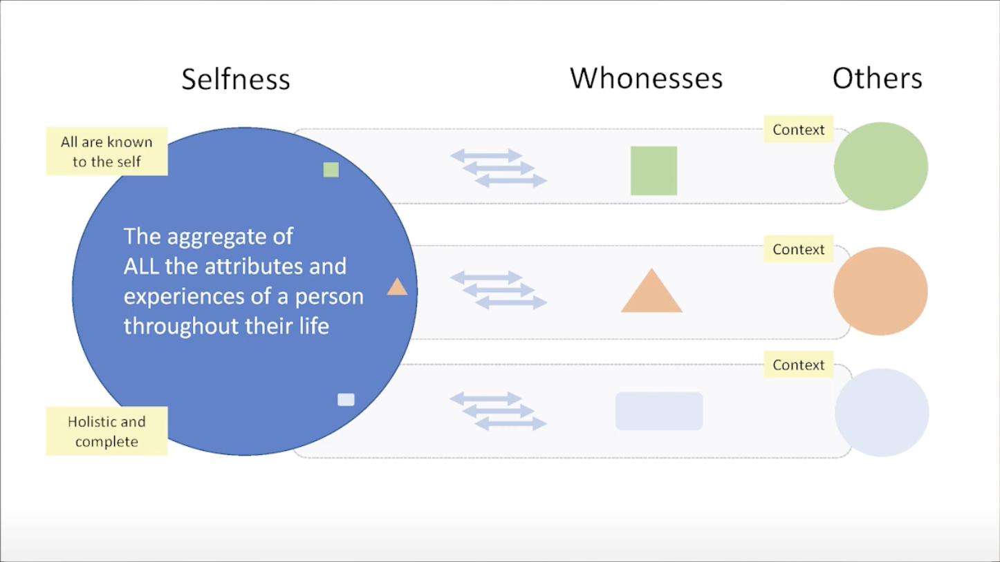

# Concepts

### Selfness vs. Whoness

In his [last public speech](https://www.youtube.com/watch?v=9DExNTY3QAk) [Kim Cameron](https://en.wikipedia.org/wiki/Kim_Cameron_(computer_scientist)) introduced two useful definitions based on archaic English:

- **Selfness**: The sameness of a person or thing at all times or in all circumstances. The condition of being a single individual. The fact that a person or thing is itself and not something else. Individuality, personality. 
- **Whoness**: Who or what a person or thing is. A distinct impression of a single person or thing presented to or perceived by others. A set of characteristics or a description that distinguishes a person or thing from others. 

The following diagram illustrates these concepts and introduces the notion of context:

 

- - 

See also [Roadmap.md](Roadmap.md).

### Classes

#### Sample Data

In the sample data shown below, a user, Alice, has two groups. The first group represents her role as a Journalist. It contains two contexts: the context of her relationship with Gmail and with Twitter. She plays a game for which there is a context (without being within a Group). The second group, entitled "News" contains only one context, her relationship with the New York Times news site.

#### 

[framework.json](framework.json) <-- extremely out of date; needs updating (5+months old)

#### Key Usage Analysis

The following are some rough sketches about what data is encrypted and how. It is not perfectly harmonized with the above "Sample Data"

### Data Types

- **ContextID** - The digital space/realm/domain within which the user is interacting. 
- **MeeID** - Identifier of any kind of Digital Subject (i.e. entity) about which data is stored in the agent. 

- **MeeAppID** - A specific kind of MeeID. Uniquely identifies an app developer's app. A single, logical, MeeAppID is associated with one or more physical apps (usually on different platforms such as mobile, webapp, etc.) all of which that creates and manages the data contents of an AppData using the same schema. [We have to think through concurrent update issues in the case of N>1 physical apps]

- **Secret Recovery Phrase** - a 12-word textual phrase that the user creates. It is used to generate cryptographic keys that in turn are used to encrypt the user’s personal data whether it is stored locally on their device or in a backup location. It can be used to generate keys to digitally sign transactions (e.g., for crypto currency transactions). It should never be shared with anyone or any service provider. If the user loses this phrase, they lose the ability to decrypt their data. 

##### Keys

* **Account key pair** is the primary user account key pair.
* **PBKDF2 key** is a key generated by using user password. It’s needed to encrypt the user account private key.
* **User device key pair** is a key pair is generated and stored on the user device. Device private key can be used to encrypt the user account private key.
* **Client key pair** is key pair to identify client app or website
* **Context key** is a key to encrypt user data in the context.

### Personal data

* [User-exclusive Data article](https://medium.com/meefound/exclusive-self-ownership-9917cb6bdd8c) - introduction to exclusive-to-the-user data
* [Categories of personal data](https://docs.google.com/spreadsheets/d/11F-V793seAon7xqFX2HEqeFhHvxttEUMkKSOrbM0ptc/edit#gid=477806070) - four main categories of user data (user input, app sensed, app generated and app inferred) and how examples of these categories are managed in different ways (user-exclusive, user-shared, user-replicated, app-shared, app-replicated or app-shared)
* Location/sharing alternatives: 

.
