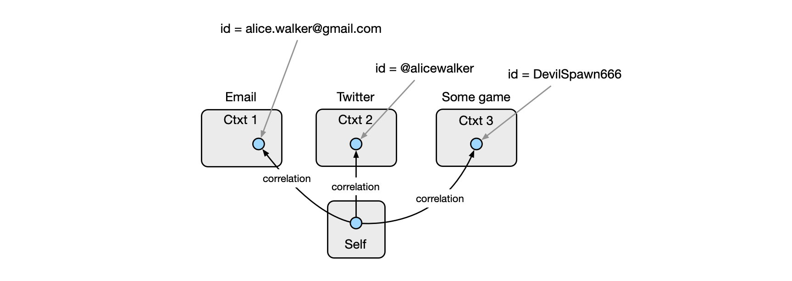
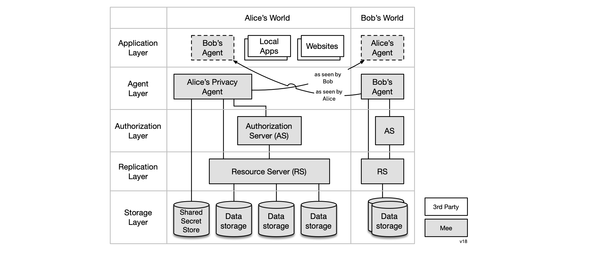
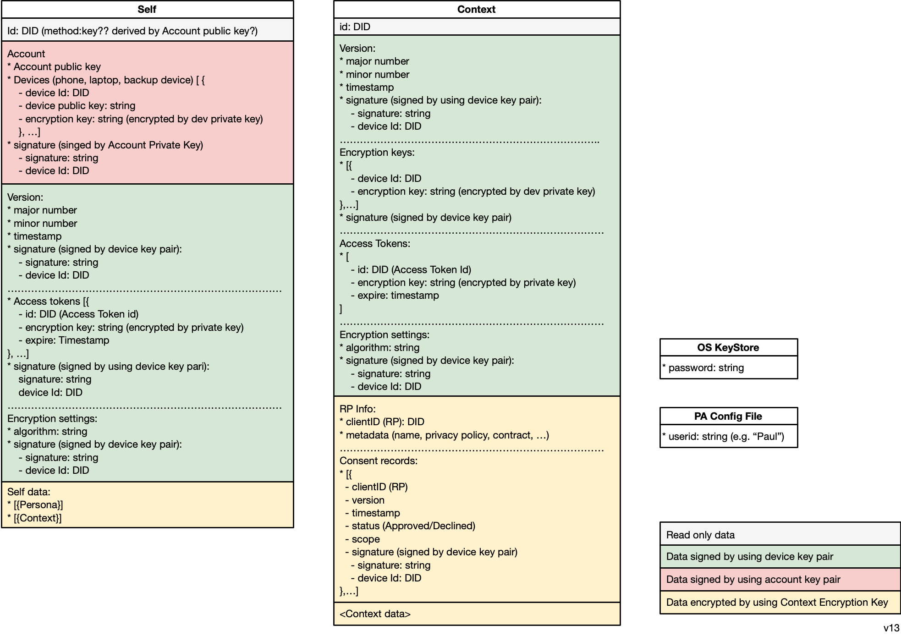
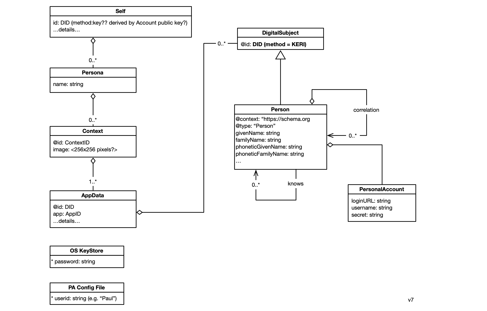
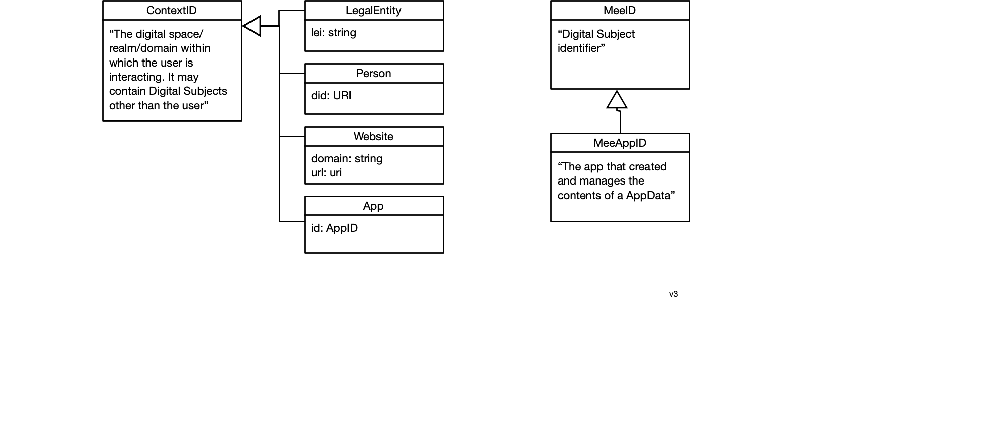
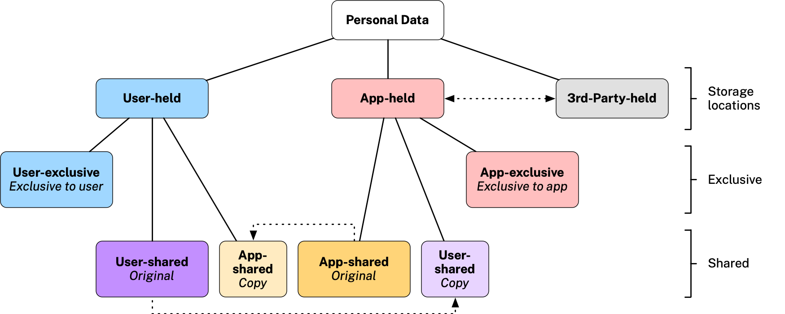

# Concepts

#### Selfness vs. Whoness

In his [last public speech](https://www.youtube.com/watch?v=9DExNTY3QAk) [Kim Cameron](https://en.wikipedia.org/wiki/Kim_Cameron_(computer_scientist)) introduced two useful definitions based on archaic English:

- **Selfness**: The sameness of a person or thing at all times or in all circumstances. The condition of being a single individual. The fact that a person or thing is itself and not something else. Individuality, personality. 
- **Whoness**: Who or what a person or thing is. A distinct impression of a single person or thing presented to or perceived by others. A set of characteristics or a description that distinguishes a person or thing from others. 

The following diagram illustrates these concepts and introduces the notion of context:

 

#### The Self and Contexts

The Mee privacy agent is a [digital twin](https://en.wikipedia.org/wiki/Digital_twin) of the user and represents both their selfness and whonesses.

The selfness of the user is represented by a data container called the *Self*. The contents of the Self are holistic and therefore quite sensitive. For this reason they would normally not be shared in a direct or comprehensive form with others. This Self abstraction is at the heart of what enables the Mee architecture to be a ""*meta*-identity system," as opposed to an identity system. The user's Self is the point of integration across contexts each of which may be from differing identity systems. 

Each context is represented by a *Context* data container. A directed *correlation* link points from the Self entity to the entity representing the self in each context. The only person who must know that in reality these contexts contain representations of the same self/user is *that* user. Each context may define its own identifier namespace, schemas, state management, communications protocols, UI, UX, etc. 

We can illustrate all of these concepts with a simple example. A user might have a gmail address, a Twitter handle, and in a game they play have the handle DevilSpawn666. Here's how this is represented:

### Privacy Agent

A privacy agent as we envision it is a minimalist, occasional use, “administrative” application designed to handle administrative tasks related to managing the user’s personal data. It preserves the user's privacy when they are interacting with Mee-compatible apps and websites that have licensed the user's data according to the terms of the Mee Human Information License. 

An agent can request access to portions of another user's data or, conversely, grant a request to portions of their own data. The agent provides a user interface to support management of the user's personal data which is typically, although not necessarily exclusively co-located on the device running the agent. 

#### Roadmap

v1 (iOS only) - October, 2022:

- Authenticate the user (e.g. via biometrics)
- One tap, "surveillance-free", sign-up & sign-in (OpenId Connect SIOP identity provider)

v2 - TBD, 2022:

- iOS and Android support

v3 - Feb, 2023

- Create a Secret Recovery Phrase (SRP)
- Support social/other SRP sharding and recovery

v4 - April 2023

- Verifiable Credential wallet 
- Integrated P2P text messaging
- Replicate user's data across the their devices
- Review some kinds of context data
- Request access to another person's data
- Authorize access to your data by another
- Manage backup/restore of user's data

v5 - October 2023

- MacOS and Windows support
- Integrated & standalone password manager

### Architecture

The Mee architecture shown below supports the privacy agent and its interactions with third-party apps and websites. The application layer includes local and remote apps and websites that the user, Alice, interacts with. Note that each person's agent appears to others an an app. The agent layer acts on behalf of Alice giving her control over her human data. The authorization layer handles requests for access to data from Alice's agent, local apps, and other user's privacy agents. The replication layer provides a resource server that is implemented by one or more physical data stores containing replicas of Alice's data following a [local-first](https://www.inkandswitch.com/local-first/) pattern. All (long-term) state of the agent and the authorization server is maintained in the storage layer.

An agent is configured with a Secret Recovery Phrase (SRP) created by the user, and never shared. For disaster recovery purposes the user is encouraged to divide the SRP into encrypted fragments according to Shamir's [How to share a secret](https://dl.acm.org/doi/10.1145/359168.359176). The agent presents the user with a choice of options for where to store these fragments including with friends, in files and optionally in a Shared Secret Store shown in the lower left above hosted by a service provider the user trusts.

### Apps

As mentioned, the privacy agent is designed to stay out of the way of the user's main interactions with Mee-compatible apps and digital services. Operating mostly in the background, it shares human information about the user with apps according to the user's information sharing preferences. This information can be used for many purposes from simplifying sign-in/sign-up, to providing contact information, payment methods, as well as preferences, interests, etc. with which apps can provide personalization, recommendations, and tailored offers. 

### Framework classes

#### Sample Data

[framework.json](framework.json) <-- needs updating

### Data Types

- **ContextID** - The digital space/realm/domain within which the user is interacting. It may contain Digital Subjects other than the user
- **AppID** - The app that created and manages the contents of a ContextContainer

- **Secret Recovery Phrase** - a 12-word textual phrase that the user creates. It is used to generate cryptographic keys that in turn are used to encrypt the user’s personal data whether it is stored locally on their device or in a backup location. It can be used to generate keys to digitally sign transactions (e.g., for crypto currency transactions). It should never be shared with anyone or any service provider. If the user loses this phrase, they lose the ability to decrypt their data. 

##### Keys

* **Account key pair** is the primary user account key pair.
* **PBKDF2 key** is a key generated by using user password. It’s needed to encrypt the user account private key.
* **User device key pair** is a key pair is generated and stored on the user device. Device private key can be used to encrypt the user account private key.
* **Client key pair** is key pair to identify client app or website
* **Context key** is a key to encrypt user data in the context.

### Personal data

* [User-exclusive Data article](https://medium.com/meefound/exclusive-self-ownership-9917cb6bdd8c) - introduction to exclusive-to-the-user data
* [Categories of personal data](https://docs.google.com/spreadsheets/d/11F-V793seAon7xqFX2HEqeFhHvxttEUMkKSOrbM0ptc/edit#gid=0) - examples of user-exclusive and app-managed data
* Location/sharing alternatives: 

.
