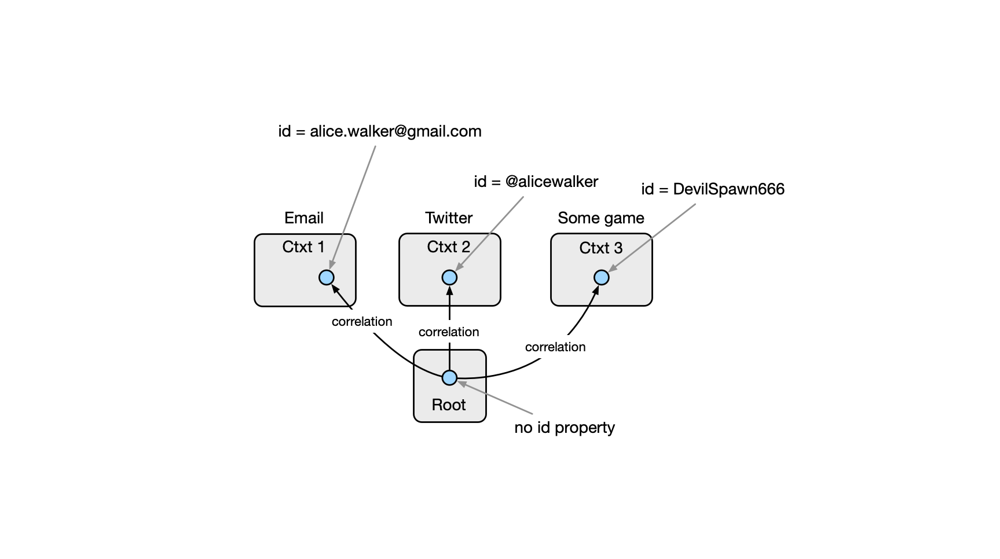
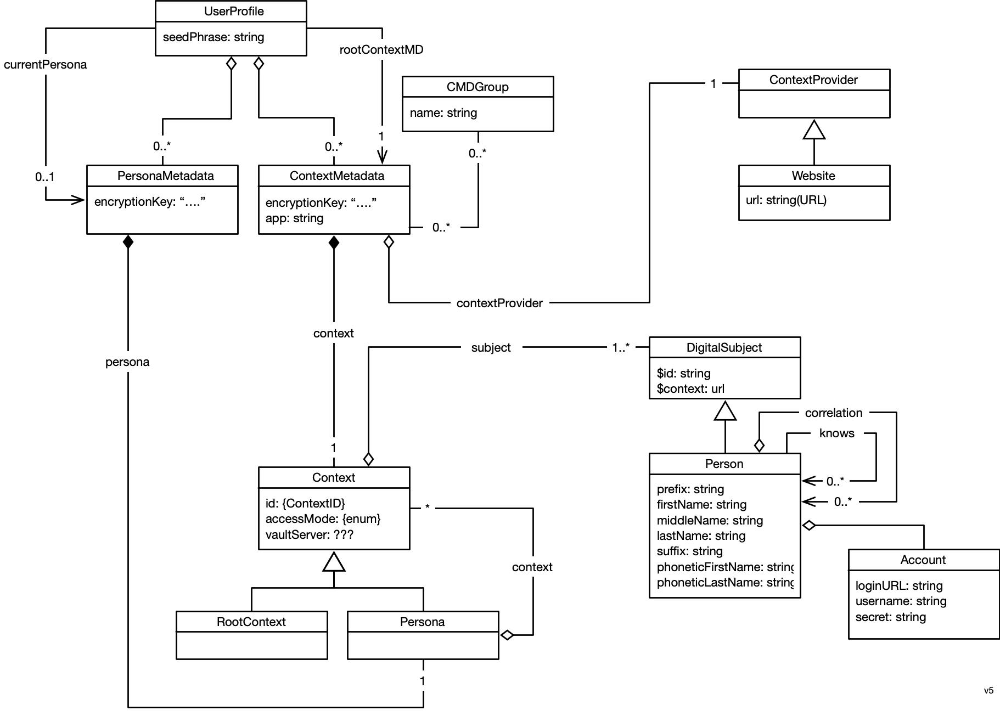
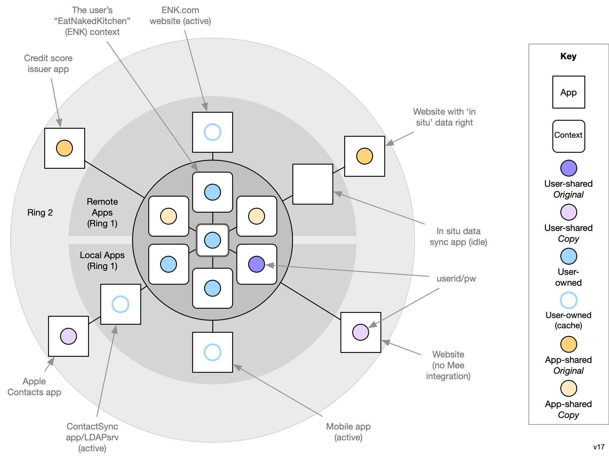

# Concepts

### Mee Framework

The Mee framework supports the Mee App and 3rd party  apps. The heart of the framework is the Resource Server which is a database of the user's personal data. The user is represented as entities (see blue circles below) within mulitple contexts arranged in a hieararchy under a root context. A context represents the user's interaction in some computer mediated realm with one or more other parties. Authorization of access to the Resource Server is controlled by the GNAP Authorization Server.

#### Root Context

The root context is the most abstract concept and possibly the hardest to understand. The Mee framework can be thought of as supporting a digital twin of the user. As such it needs to represent the very abstract notion that the human user, when using various digital systems exists as many partial identities in different contexts. 

The user is the single point of integration across these contexts, and in in privacy-first design the only entity who needs to know that these are are all digital embodiments of the same person is that person. We represent the person as a entity within the root context, and we represent their identities in other non-root  contexts as other entities. We add a directed "correlation" link pointing from the entity in the root context that represents the person to each of its embodiment entities in each context. This "root context" abstraction is at the heart of what enables the Mee Framwork be a meta-identity system, not an identity system. Each context can define its own identifier namespace, schemas, state management, communications protocols, UI, UX, etc. independently. 

As an example a person might have a couple email addresses, a Twitter handle and in some game they play as DevilSpawn666. Here's how this is represented:

#### Secret Storage Service

At the right is a separate cloud-based component called the Secret Storage Service which can be used by the Mee user to store encrypted, partial fragments of their seed phrase as an optional mechanism to help the user recover all of their data in the event that all of the user's devices have been lost, stolen, damaged, etc.

### Framework Data Model

#### Sample Data

[framework.json](framework.json)

#### Data Types

- **Seed Phrase** - a 12-word textual phrase that the user creates. It is used to generate cryptographic keys that in turn are used to encrypt the user’s personal data whether it is stored locally on their device or in a backup location**.** It can be used to generate keys to digitally sign transactions (e.g., for crypto currency transactions). It should never be shared with anyone or any service provider. If the user loses this phrase, they lose the ability to decrypt their data. 

##### Keys

* **Account key pair** is the primary user account key pair.
* **PBKDF2 key** is a key generated by using user password. It’s needed to encrypt the user account private key.
* **User device key pair** is a key pair is generated and stored on the user device. Device private key can be used to encrypt the user account private key.
* **Client key pair** is key pair to identify client app or website
* **Context key** is a key to encrypt user data in the context.

### Rings

The Mee framework can be drawn as three concentric rings containing PDS, PDS “contexts”, and apps that hold the user’s personal data.

* **Ring 0:** The most sensitive information about a user consists of the linkages between the user and their multiple partial digital identities across different interaction contexts. This linkage information is stored in the innermost ring, ring 0 in what’s called the “root context” within the personal data store itself.
* **Ring 1** contains highly trusted apps that comply with the Ring 1 agreement. They read/write data from/to “context” containers managed by the PDS.
* **Ring 2** contains less trusted apps that comply with the Ring 2 agreement. They store copies of the user’s personal information and synchronize these copies with the copy in the user’s personal data store.

### Personal data

* [User-exclusive Data article](https://medium.com/meefound/exclusive-self-ownership-9917cb6bdd8c) - introduction to exclusive-to-the-user data
* [Categories of personal data](https://docs.google.com/spreadsheets/d/11F-V793seAon7xqFX2HEqeFhHvxttEUMkKSOrbM0ptc/edit#gid=0) - examples of user-owned and app-managed data
* Location/sharing alternatives: 

### Data Sharing Agreements

Developers of Mee-compatible mobile apps and websites may choose to sign an agreement that includes limits on what they may do with the user’s data:

* *Ring 1 agreement:* compels the firm’s app(s) to not store copies of user-owned data nor sharing any user  user’s data with any other entity. [user benefits: privacy and control]
* *Ring 2 agreement:* a weaker agreement than above that allows the firm’s app(s) to store copies of user data, such that the latest values of app-asserted attributes about the user are always written to the user’s personal data store and the user may choose to update the app’s copy with the latest user-asserted attributes from the user’s personal data store. [user benefits: control]

If they agree to neither of the above then the user gains no additional guarantees WRT data handling beyond what existing laws provide.