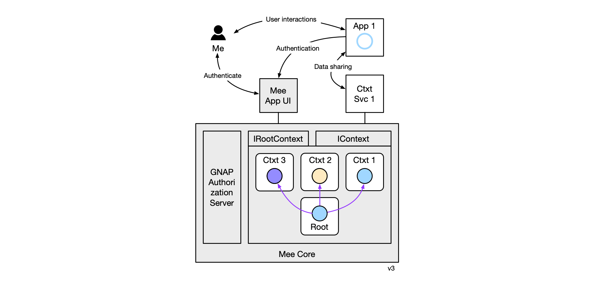

# Concepts

### Personal data

* [Exclusive Self-Ownership article](https://medium.com/meefound/exclusive-self-ownership-9917cb6bdd8c) - introduction to user-owned data

* [Categories of personal data](https://docs.google.com/spreadsheets/d/11F-V793seAon7xqFX2HEqeFhHvxttEUMkKSOrbM0ptc/edit#gid=0) - examples of user-owned and app-managed data

* Location/sharing alternatives: 

### Framework Architecture

The Mee framework provides core services to support Context Services. A Mee App with UI is also supported.

##### IApp

Responsibility: an app provides some service to the user. If it acts as a credential issuer it must support this interface. Methods: 

- getVerifiableCredential

##### IContextService

Responsibility: act as an adaptor adapting an app to the Mee Core API. Methods:

- GetVerifiableCredential - called by a Context

##### IContext

Responsibilities: manage context data storage (as a graphQL server?), replication and backup. Methods:

- CRUD attribute data - graphQL?

##### IRootContext

Manage root context data storage, replication and backup. Methods:

- getAuthMaterials - get return un/pw to login to a website
- openContext(CID) - open (or create) a context, given a ContextID (CID)

### Rings

The Mee framework can be drawn as three concentric rings containing PDS, PDS “contexts”, and apps that hold the user’s personal data.

* **Ring 0:** The most sensitive information about a user consists of the linkages between the user and their multiple partial digital identities across different interaction contexts. This linkage information is stored in the innermost ring, ring 0 in what’s called the “root context” within the personal data store itself.
* **Ring 1** contains highly trusted apps that comply with the Ring 1 agreement. They read/write data from/to “context” containers managed by the PDS.
* **Ring 2** contains less trusted apps that comply with the Ring 2 agreement. They store copies of the user’s personal information and synchronize these copies with the copy in the user’s personal data store.

### Data Types

#### Keys

* **Account key pair** is the primary user account key pair.
* **PBKDF2 key** is a key generated by using user password. It’s needed to encrypt the user account private key.
* **User device key pair** is a key pair is generated and stored on the user device. Device private key can be used to encrypt the user account private key.
* **Client key pair** is key pair to identify client app or website
* **Context key** is a key to encrypt user data in the context.

### Data Sharing Agreements

Developers of Mee-compatible mobile apps and websites may choose to sign an agreement that includes limits on what they may do with the user’s data:

* *Ring 1 agreement:* compels the firm’s app(s) to not store copies of user-owned data nor sharing any user  user’s data with any other entity. [user benefits: privacy and control]
* *Ring 2 agreement:* a weaker agreement than above that allows the firm’s app(s) to store copies of user data, such that the latest values of app-asserted attributes about the user are always written to the user’s personal data store and the user may choose to update the app’s copy with the latest user-asserted attributes from the user’s personal data store. [user benefits: control]

If they agree to neither of the above then the user gains no additional guarantees WRT data handling beyond what existing laws provide.