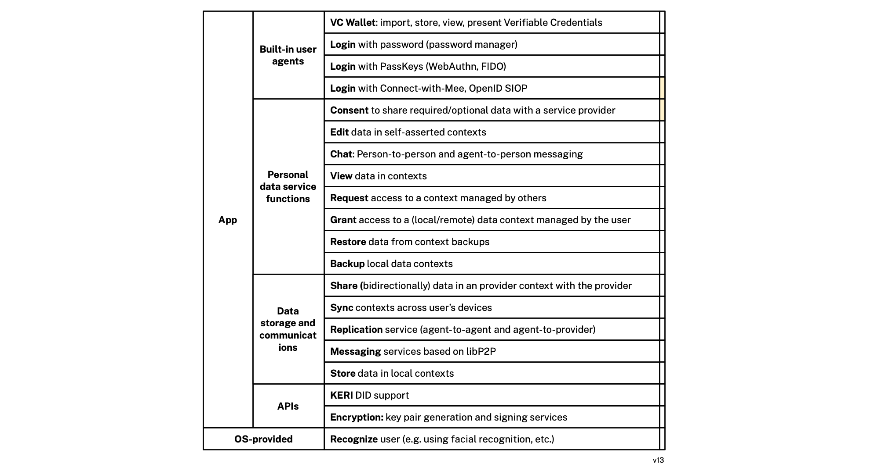

# Concepts

### Selfness vs. Whoness

In his [last public speech](https://www.youtube.com/watch?v=9DExNTY3QAk) [Kim Cameron](https://en.wikipedia.org/wiki/Kim_Cameron_(computer_scientist)) introduced two useful definitions based on archaic English:

- **Selfness**: The sameness of a person or thing at all times or in all circumstances. The condition of being a single individual. The fact that a person or thing is itself and not something else. Individuality, personality. 
- **Whoness**: Who or what a person or thing is. A distinct impression of a single person or thing presented to or perceived by others. A set of characteristics or a description that distinguishes a person or thing from others. 

The following diagram illustrates these concepts and introduces the notion of context:

 

### Privacy Agent - end-user perspective

A privacy agent is a minimalist, occasional use application that manages a Personal Digital Twin of the user's self and its expression in different contexts. It preserves the user's privacy when they are interacting with Mee-compatible apps and websites that have licensed the user's data according to the terms of the Mee Human Information License. 

Although a privacy agent is an interactive application, it operates mostly in the background, sharing and managing human information about the user with Mee-compatible apps according to the user's information sharing preferences and under the terms of the Human Information License. The user's information can be used for many purposes. These include: simplifying sign-in/sign-up, to providing contact information, payment methods, as well as sharing preferences, interests, etc.  which apps can use to provide personalization, recommendations, and tailored offers. 

### Privacy Agent - self and contexts

The Mee privacy agent is a [digital twin](https://en.wikipedia.org/wiki/Digital_twin) of the user and represents both their selfness and whonesses.

The selfness of the user is represented by a data container called the *Self*. The contents of the Self are holistic and therefore quite sensitive. For this reason they would normally not be shared in a direct or comprehensive form with others. This Self abstraction is at the heart of what enables the Mee architecture to be a ""*meta*-identity system," as opposed to an identity system. The user's Self is the point of integration across contexts each of which may be from differing identity systems. 

Each context is represented by a *Context* data container. A directed *correlation* link points from the Self entity to the entity representing the self in each context. The only person who must know that in reality these contexts contain representations of the same self/user is *that* user. Each context may define its own identifier namespace, schemas, state management, communications protocols, UI, UX, etc. 

We can illustrate all of these concepts with a simple example. A user might have a gmail address, a Twitter handle, and in a game they play have the handle DevilSpawn666. Here's a simplified view of how this is represented:

### Privacy Agent - end user functionality

**End-user functionality:**

- **Edit** data in self-asserted contexts
- **Chat**: Person-to-person and agent-to-person chat
- **App-to-Agent Messaging**. Ability for apps to communicate with the agent using alternative transports (Initially LibP2P and TCP/IP).
- **View** data in contexts
- **Share** data bi-directionally with apps
- **Replicate** contexts across users's devices and to apps

- **Request** access to a context managed by others
- **Grant** access to a (local or remote) data context managed by the user
- **Replicate** user's data accross their devices
- **Backup/restore** local context data

- **Store** data in local contexts
  - Data is stored according to shared or app-specific schema. In some contexts this local data is authoritative whereas in other cases it is a copy of externally managed context data.

- **Authenticate** user (e.g. using facial recognition, etc.)

- **Manage** a Secret Recovery Phrase
  - During installation the user is asked create a **Secret Recovery Phrase (SRP)** that is never shared. This SRP is used as a source of entropy for the generation of cryptographic keys and thus acts as a root for a person's identity. Their data is encrypted using keys generated from the SRP. For disaster recovery purposes the user is encouraged to divide the SRP into encrypted fragments according to Shamir's [How to share a secret](https://dl.acm.org/doi/10.1145/359168.359176). The agent presents the user with a choice of options for where to store these fragments including with friends (for "social recovery"), in files and optionally in a Shared Secret Service hosted by a service provider the user trusts.

See also [Roadmap.md](Roadmap.md).

### Architecture

The Mee multi-layer architecture is shown below:

**Application layer**

The application layer consists of Mee-compatible apps. The diagram shows 4 sample apps that Alice might interact with. These include, a local app, an app that is a facade for Bob's agent, a newpaper website app (NYTimes), and a medical lab app. Note: each person's agent appears to other users' agents as an app called the *agent facade*. 

**Agent layer**

The agent layer consists of a privacy agent app with a UI that gives the user (Alice or Bob) control over the management of their data. The agent's UI allows Alice to inspect and in some cases edit each of the partial representations of her in each context. 

**Request & Authorization layer**

The request and authorization layer handles requests for access to data from Alice's agent as well as from local apps, remote apps, and other user's privacy agents. Alice's authorization server grants or revokes access by these requests to data in the context data storage layer. 

**Data Access & Replication layer**

The data access and replication layer provides data access (as controlled by tha authorization layer above) to the data in each of Alice's contexts. It manages the replication of changes to the data in one of Alice's contexts both (i) between the corresponding app and Alice's agent as well as (ii) among Alice's edge devices (phone, tablet, laptop, etc.).

**Context Data Storage layer**

The context data storage layer holds a set of contextualized representation of the user as defined by an app. For the 4 sample apps we're discussing here, 3 corresponding context data stores stored on Alice's device--the Med Lab app's context data store is not replicated on Alice's local device (perhaps as a hypothetical example because the medical data set is too large for Alice's device)

### Classes

#### Sample Data

In the sample data shown below, a user, Alice, has two groups. The first group represents her role as a Journalist. It contains two contexts: the context of her relationship with Gmail and with Twitter. She plays a game for which there is a context (without being within a Group). The second group, entitled "News" contains only one context, her relationship with the New York Times news site.

#### 

[framework.json](framework.json) <-- extremely out of date; needs updating (5+months old)

#### Key Usage Analysis

The following are some rough sketches about what data is encrypted and how. It is not perfectly harmonized with the above "Sample Data"

### Data Types

- **ContextID** - The digital space/realm/domain within which the user is interacting. 
- **MeeID** - Identifier of any kind of Digital Subject (i.e. entity) about which data is stored in the agent. 

- **MeeAppID** - A specific kind of MeeID. Uniquely identifies an app developer's app. A single, logical, MeeAppID is associated with one or more physical apps (usually on different platforms such as mobile, webapp, etc.) all of which that creates and manages the data contents of an AppData using the same schema. [We have to think through concurrent update issues in the case of N>1 physical apps]

- **Secret Recovery Phrase** - a 12-word textual phrase that the user creates. It is used to generate cryptographic keys that in turn are used to encrypt the user’s personal data whether it is stored locally on their device or in a backup location. It can be used to generate keys to digitally sign transactions (e.g., for crypto currency transactions). It should never be shared with anyone or any service provider. If the user loses this phrase, they lose the ability to decrypt their data. 

##### Keys

* **Account key pair** is the primary user account key pair.
* **PBKDF2 key** is a key generated by using user password. It’s needed to encrypt the user account private key.
* **User device key pair** is a key pair is generated and stored on the user device. Device private key can be used to encrypt the user account private key.
* **Client key pair** is key pair to identify client app or website
* **Context key** is a key to encrypt user data in the context.

### Personal data

* [User-exclusive Data article](https://medium.com/meefound/exclusive-self-ownership-9917cb6bdd8c) - introduction to exclusive-to-the-user data
* [Categories of personal data](https://docs.google.com/spreadsheets/d/11F-V793seAon7xqFX2HEqeFhHvxttEUMkKSOrbM0ptc/edit#gid=477806070) - four main categories of user data (user input, app sensed, app generated and app inferred) and how examples of these categories are managed in different ways (user-exclusive, user-shared, user-replicated, app-shared, app-replicated or app-shared)
* Location/sharing alternatives: 

.
