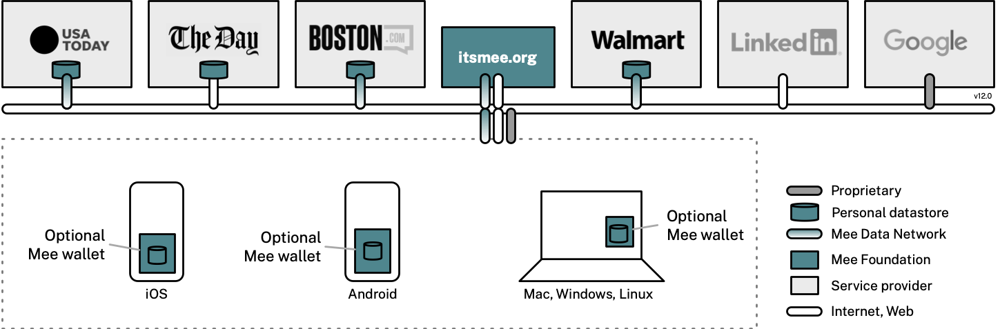

We’re a nonprofit whose mission is to develop Mee–a human-centered user experience for the internet. In the Mee experience:

- You don’t have to fill in forms–passwords, names and more
- Your data is never shared or sold by anyone
- Your legal right to control your own data is enforced
- Your activities remain private–no more tracking or spying on you

The company logos in the diagram below are purely hypothetical/aspirational:

This experience is made possible by the Mee Data Network (MDN). The MDN is a set of Mee-authorized service provider’s mobile and web apps that store and manage personal data under the terms of a privacy-respecting MDN license agreement. These apps implement MDN communications protocols that enable this information to be controlled by identity agents working on behalf of the user.

Identity agents give the user a centralized point of control over the personal data managed by service provider’s apps wherever it is stored. TMF is developing a *virtual agent* (at itsmee dot org) and *local agents* that run on your devices. Using MDN protocols these agents implement and enforce the users legal *data rights* to access, correct, erase their personal data held by apps, or to move it to other apps.

To accelerate support for MDN we provide web service components and SDKs to adapt existing websites and apps. MDN makes possible *private* ad networks which advertisers can use to reach cohorts of users with common interests without the surveillance, tracking and privacy risks associated with conventional adtech.

To operate on the MDN service providers must be authorized by the Mee Foundation and agree to the terms of the MDN License. This license states what service providers can and cannot do with the user’s personal data. For example, it requires apps to get opt-in consent from the user before sharing/selling their data to other entities. It also requires that the service provider’s apps implement MDN protocols so they can interoperate with the user’s agent(s).

As part of our charitable, scientific, and educational goals we develop and freely publish in open source our research and software development of identity agents and related software components and SDKs. 

TMF also acts as a fiduciary, acting on behalf of individuals to enforce that service providers on the Mee Data Network adhere to the terms of the MDN License.

### Identity Agents

#### Protect your privacy

* Tells apps/sites “Do Not Track” and “Do Not Sell My Personal Information”
* Works automatically behind the scenes

#### Manage your stuff
* Retrieves your data from apps/sites you use
* Organizes it conveniently across all of your apps/sites
* Stores your data on-device (nothing is shared with The Mee Foundation)

#### Represent you online
* No more passwords–you’re logged in immediately
* No more creating accounts and filling in forms
* The MDN supports private sharing: tap the Continue-with-Mee button on apps/sites to create a data private data sharing connection [under development]
* Share privacy-protected advertising interest profiles  to increase relevance of content and offers [under development]

:::caution[Work in progress]
Mee is in early development.
If you find something that’s not working, [open an issue on GitHub](https://github.com/MeeFoundation).
:::

## For Providers
If you're a service provider and would like to learn how to make your app/site compatible then have a look at [Connect with Mee](/developers/integration/connect-with-mee).

Mee is a work in progress; the future directions and milestones are described in our [Roadmap](/user/contributing/roadmap). The [Releases](/releases) page lists the deliverables available right now. Here is some of the [Terminology](/user/basics/terminology) we use.
