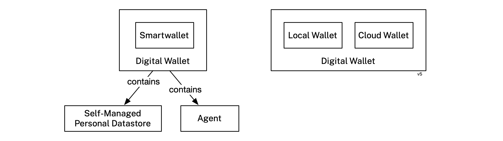

## Ad Profile Service

A service that queries data from the user's *PDS*(es), anonymizes it, and transforms it an advertising profile database. Profile data is never shared/sold with any other entity. The data can be queried by advertisers to return the number of (non-identified) users within a defined target audience. 

## App

A website, web service, mobile, tablet, laptop or desktop app (or the *smartwallet* of another user) that communicates with the user's *smartwallet* or *PDS* (or both).

## Claim

An assertion made about a *subject* in a *context*.

## Connection

A relationship between (a) a *smartwallet* or a *PDS*, and (b) an *app*, *PDS* or *smartwallet*. A *connection*'s state is stored by one or more *contexts*. 

## Connector

A software component that implements one aspect of a *connection*. It implements a *connector* interface (abstraction) at the core of a *smartwallet* or a *PDS*. It is associated with a single *context*. It may receive data from the *app* and store it in this *context*, and/or it may read data from the *context* and transmit it to the *app*.

## Wallet SDK

A *local* *app* can become interoperable with the *Mee data network* using a *wallet SDK*. The SDK manages personal data that is either (i) generated by the local app or (ii) received over the *Mee data network* from a *PDS* or a *smartwallet*.

## Wallet Service

A web *app* can become interoperable with the *Mee data network* using a *wallet service*. A *wallet service* is a multi-user, cloud-based web service. The wallet service manages personal data that is either (i) generated by the web app or (ii) received over the *Mee data network* from a *PDS* or *smartwallet*.

## Context

A container of data that holds the state for one aspect of a *connection*. The *container* contains an entity that represents the user along with a set of *claims* about them. It may also contain entities representing other *subjects* along with their *claims*.

## Digital Wallet

A *digital wallet* is a software program or web service that securely stores and conveniently organizes a person's payment methods, boarding passes, event tickets in one place. Recently the definition has expanded to include digital credentials like driver's licenses, passports, and certifications usually packaged as Verifiable Credentials that can be issued to the wallet by an issuer and presented from the wallet to a verifier. 

A *digital wallet* is comprised of two components: an agent and a personal datastore. The state of a *local wallet* is held in the datastore and the agent is responsible for interacting with the outside world (e.g. issuers and *relying parties*). The agent is an active component that works on behalf the user and manages the contents of the datastore. 

### Local Wallet

A *digital wallet* that runs on the user's local devices (e.g. smartphone, tablet, or laptop) either as a standalone app, a browser extension, or a combination of both. 

The state of the local wallet may be replicated (i.e. copied and synchronized) across multiple wallet replicas. For example, a user could have an iOS *wallet* whose personal datastore state is replicated bidirectionally with their MacOS *wallet* app. This gives the user the convenience of being able to use any of their *wallet* apps in the confidence that each has the same state (e.g. the same set of connections, etc.).

### Cloud Wallet

A *digital wallet* that runs in the cloud or is self-hosted. Its personal datastore is stored in the cloud.

### Smartwallet

A *smartwallet* is a kind of *digital wallet* that:

- May include dynamic data sharing *connections* to *relying parties* wherein information can be updated over time. This information can flow periodically or continuously from an external party to the wallet, in the reverse direction, or in both directions.
- Allows the user to license their information to a *relying party's* app under the terms of a data sharing agreement, thereby allowing the user to retain significant control over their information stored by the *relying party*.
- Supports smartwallet-to-smartwallet messaging with minimal reliance on intermediary cloud-based services.

Smartwallets may be *local wallets* (*local smartwallets*) or *cloud wallets* (*cloud smartwallets*). The Mee Foundation is developing local *smartwallets*.

### Wallet SDK

The platform-independent core logic of a *smartwallet* or a local *app* that enables them to be compatible with the *Mee data network.*  

## Mee Directory Service

A central directory service  that maps user ids to the user's "home" *PDS*. It does not perform authentication---this is the responsibility of the *PDS*. 

## Human Information License

A data sharing agreement between the business providing the *app* and The Mee Foundation (or its delegate), acting on the *smartwallet* or *PDS* user's behalf. This contract licenses the user's information under specific terms. In the Mee HIL, the business or other kind of organization (i) must not collect, use, retain, or share the user's information with any other party without consent, and (ii) must implement APIs that enable the user's *smartwallet* or *PDS* to remotely control their data.

## Mee-certified

*Mee-certified* is an adjective applied to an *app* wherein the user's information involved in a data sharing connection with this *app* is subject to the terms of a *human information license* agreement. To be Mee-certified an app may also have to adhere to a set of specific UI guidelines.

## Mee-compatible

*Mee-compatible* is an adjective applied to an *apps*, *PDSes* and *smartwallets* on the *Mee data network*.

## Mee Data Network

Mee-compatible apps, *PDSes* and *smartwallets* that exchange personal data under the user's control. 

## Personal Data Service (PDS)

A web service that authenticates the user and remotely manages their personal information (e.g. interests, contact information, affiliations, preferences, friends, etc.) that is stored in multiple distributed personal datastores on the *Mee data network*. These personal datastores are embedded within local *apps* (that integrate a *wallet SDK*) and/or web *apps* (that integrate a *wallet service*) and/or *smartwallets*. 

A *PDS* relays requests for access from *app* A to data held by *app* B, and if the user of *app* B grants the request, relays back the requested data. The Mee Foundation is implementing a *PDS* that it plans to host at https://itsmee.org

## Protocol

A communication protocol used between a *PDS* or *smartwallet* and an *app*.

## Relying Party (RP)

A *subject* with which the user interacts using a *PDS* or a *smartwallet*. An *RP* may be another user (of a PDS or a *smartwallet*) or a *provider*.

For example, in a *connection* between the user's *smartwallet* and a typical *app*, the *relying party* is the *provider* that offers the *app*. If the *app* is another user's *smartwallet*, the *relying party* is this other user.

## Self

A singleton data container holding a single *person* entity that represents the *selfness* of the user.

## Selfness

The sameness of a *person* or a thing at all times or in all circumstances. The condition of being a single individual. The fact that a *person* or thing is itself and not something else. Individuality, personality. 

## Subject

A thing about which *claims* are made. 

### Corporation

A *subject* that represents an incorporated legal entity.

### Person

A *subject* that represents a natural person.

### Provider

A *corporation* that provides an *app* for its users. 

## Whoness

A distinct impression of a single *person* or thing presented to or perceived by others. A set of characteristics or a description that distinguishes one *person* or thing from other people or things.