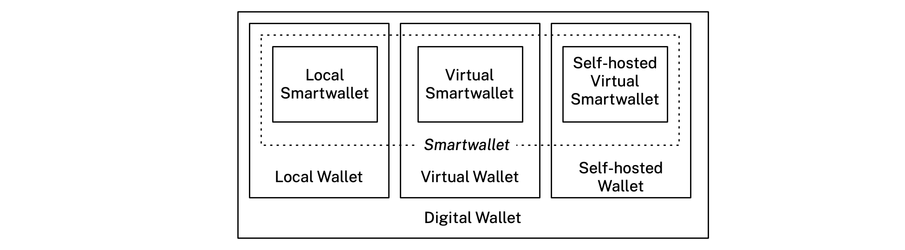

#### App

A website, web service, mobile, tablet, laptop or desktop app (or the *smartwallet* of another *holder*) that communicates with the *holder's* *smartwallet*.

#### Claim

An assertion made about a *subject* in a *context*.

#### Connection

A relationship between a *smartwallet* (acting on behalf of its *holder*) and an *other* which is represented by an *app* or another *smartwallet*. A *connection*'s state is stored by one or more *contexts*. 

#### Connector

Code that implements one aspect of a *connection*. This code implements a Connector interface/abstraction at the core of the smartwallet. It is associated with a single *context*. It may receive data from the *app* and store it in this *context*, and/or it may read data from the *context* and transmit it to the *app*.

#### Context

A container of data that holds the state for one aspect of a *connection*. The *container* contains a *person* entity that represents the *holder* along with a set of *claims* about them. It may also contain entities representing other *subjects* along with their *claims*.

#### Digital Wallet

A *digital wallet* is a software program or web service that securely stores and conveniently organizes a person's payment methods, boarding passes, event tickets in one place. Recently the definition has expanded to include digital credentials like driver's licenses, passports, and certifications usually packaged as Verifiable Credentials that can be issued to the wallet by an issuer and presented from the wallet to a verifier. 

##### Local Wallet

A *digital wallet* app that runs on the *holder's* local devices (e.g. smartphone, tablet, or laptop). 

The state of a *local wallet* may be replicated (i.e. copied and synchronized) across multiple *physical* replicas with each replica running as its own application. For example a *holder* could have an iOS *wallet* whose state it replicated bidirectionally with their MacOS *wallet* app. This affords the *holder* the convenience of being able to pick up and use any of their *wallet* apps knowing that each has the same state (i.e. the same set of connections, etc.).

##### Virtual Wallet

A *digital wallet* that is partially centralized on a web service and partially embedded within one or more *apps*. The holder's personal data that has been shared with (or generated within) each *Other's* *app* remains within that *app* and is not stored in the the web service. This central service acts as a coordinator of the multiple fragments of the overall virtual wallet that are embedded within the *apps*.

##### Cloud Wallet

A *digital wallet* that runs stores its data in the cloud (or is self-hosted).

##### Smartwallet

A *smartwallet* is a kind of *digital wallet:* It extends the wallet concept as follows:

- It adds dynamic data sharing *connections* to other parties wherein information can be updated over time. This information can flow periodically or continuously from an external party to the wallet, in the reverse direction, or in both directions.
- It allows the holder to license their information to an Other's app under the terms of a data sharing agreement, thereby allowing the holder to retain significant control over their information stored by the Other.
- It supports wallet-to-wallet messaging using little or no reliance on intermediary cloud-based services.

Smartwallets may be local wallets (called **Local Smartwallets**), virtual wallets (called **Virtual Smartwallets**) or cloud wallets (called **Cloud Virtual Wallets**). The Mee Foundation is developing Local Smartwallets and Virtual Smartwallets.

#### Holder

The *person* that has installed and uses the *smartwallet* on one or more of their devices (e.g. phone, tablet, laptop, home server, etc.).

#### Human Information License

A data sharing contract between the business providing the *app* and The Mee Foundation (or delegate), acting on the *holder's* behalf. This contract licenses the *holder's* information under specific terms. The business or other kind of organization (i) must not collect, use, retain, or share the *holder’s* information with any other party without consent, and (ii) must implement APIs that enable the *holder's* *smartwallet* to remotely control their data.

#### Mee-certified

An *app* offered by a business (or other kind of organization) (aka the relying party), that is interoperable with the *smartwallet*. In addition, the Mee *holder's* information involved in a data sharing connection with this *app* is subject to the terms of a valid *human information license* agreement.

#### Mee-compatible

An *app* offered by an online service provider business (or other kind of organization) (aka the relying party) that is interoperable with the *smartwallet*. That is, there is at least one protocol that both can speak.

#### Other

A kind of *subject*. In a *connection* between the *holder's* *smartwallet* and an *app*, if the app a mobile app, local app or webapp, then the *other* is the legal entity (often called a relying party) that provides the app, else (i.e. when the *app* is another person's *smartwallet*) the person using this *smartwallet* is the *other*.

#### Person

A *subject* that represents a natural person.

#### Protocol

A communication protocol used between the *smartwallet* and an *app*.

#### Self

A singleton data container holding a single *Person* entity that represents the *selfness* of the *person.*

#### Selfness

The sameness of a *person* or a thing at all times or in all circumstances. The condition of being a single individual. The fact that a *person* or thing is itself and not something else. Individuality, personality. 

#### Subject

A thing about which *claims* are made.

#### Whoness

A distinct impression of a single *person* or thing presented to or perceived by *others*. A set of characteristics or a description that distinguishes a *person* or thing from others. 
