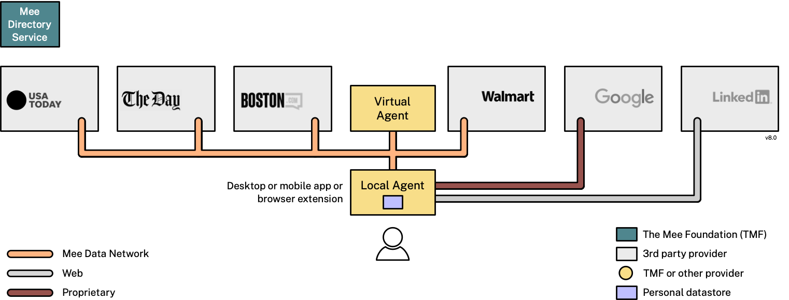

We’re a nonprofit whose mission is to develop Mee–a human-centered user experience for the internet. In the Mee experience:

- You don’t have to fill in forms–passwords, names and more
- Your data is never shared or sold by anyone
- Your legal right to control your own data is enforced
- Your activities remain private–no more tracking or spying on you

The company logos in the diagram below are purely hypothetical/aspirational:

This experience is made possible by the **Mee Data Network (MDN)**, internet protocols that allow personal information to be managed by Mee-authorized businesses' apps and websites while respecting the users legal rights (e.g. to access, correct, erase and move their personal information)

We develop reference implementations of **identity agents** that give users a centralized point of control over what apps/sites can do with their personal information in the MDN. We’re developing *virtual agents* (websites) and *local agents* (apps that run on your devices).

To accelerate support for MDN we provide **web service components and SDKs** to adapt existing websites and apps. MDN makes possible *private* ad networks which advertisers can use to reach cohorts of users with common interests without the surveillance, tracking and privacy risks associated with conventional adtech.

To operate on the MDN business must be authorized by The Mee Foundation and agree to the terms of the MDN License.

As part of our charitable, scientific, and educational goals we develop and freely publish in open source our research and software development of personal data agents (websites) and smartwallets (apps) and related software components and SDKs. 

### Identity Agents

#### Protect your privacy

* Tells apps/sites “Do Not Track” and “Do Not Sell My Personal Information”
* Works automatically behind the scenes

#### Manage your stuff
* Retrieves your data from apps/sites you use
* Organizes it conveniently across all of your apps/sites
* Stores your data on-device (nothing is shared with The Mee Foundation)

#### Represent you online
* No more passwords–you’re logged in immediately
* No more creating accounts and filling in forms
* The MDN supports private sharing: tap the Continue-with-Mee button on apps/sites to create a data private data sharing connection [under development]
* Share privacy-protected advertising interest profiles  to increase relevance of content and offers [under development]

:::caution[Work in progress]
Mee is in early development.
If you find something that’s not working, [open an issue on GitHub](https://github.com/MeeFoundation).
:::

## For Providers
If you're a service provider and would like to learn how to make your app/site compatible then have a look at [Connect with Mee](/integration/connect-with-mee).

Mee is a work in progress; the future directions and milestones are described in our [Roadmap](/contributing/roadmap). The [Releases](/releases) page lists the deliverables available right now. Here is some of the [Terminology](/basics/terminology) we use.
