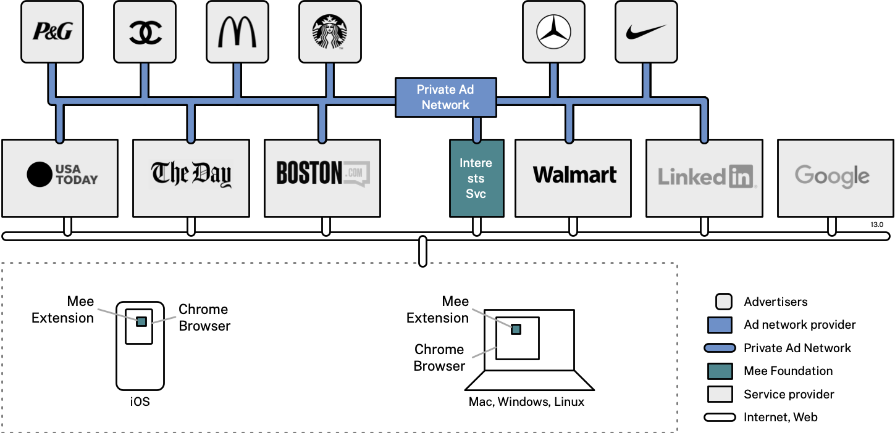

We’re a nonprofit whose mission is to develop Mee–a human-centered user experience for the internet. In the Mee experience:

- You don’t have to fill in forms–passwords, names and more
- Your data is never shared or sold by anyone
- Your legal right to control your own data is enforced
- Your activities remain private–no more tracking or spying on you

Private Advertising is a project wherein we apply this Mee experience to internet advertising. 

The solution has a front-end component, the Mee Extension, and back-end services including an Interests Service and a Private Ad Network 

The company logos in the diagram below are purely hypothetical/aspirational:

