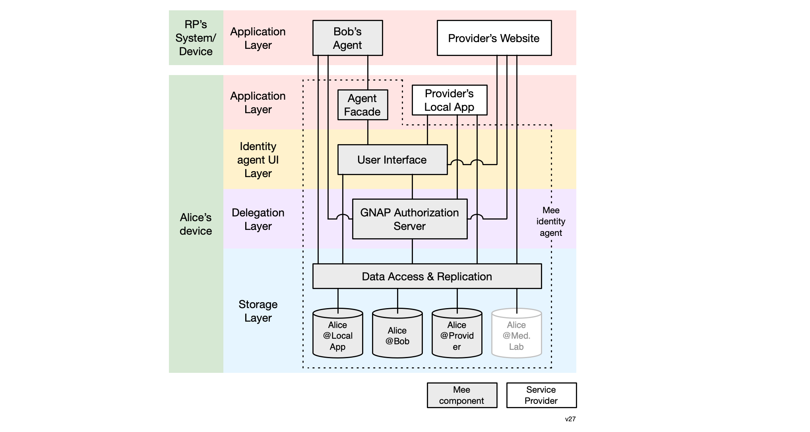

# Architecture

### **Overview**

The Mee architecture follows a decentralized, layered architecture shown below. We describe this archicture by considering a user, Alice, with her own device (e.g. a smart phone) as well as two other example relying parties (RPs) running remotely.

### **Application layer**

Mee-compatible applications in the application layer may be service provider websites ("Provider's Website" above), other user's agents running on their own devices ("Bob's Agent"), or a service provider's local app running on Alice's device ("Provider's Local App"). Alice's agent appears to other users' agents as an app. The component supporting this on Alice's side is called the Agent Facade.

### **Identity Agent UI Layer**

Alice's identity agent is deployed as an app on Alice's device. The top of layer of this agent-app is the Identiy agent UI Layer that provides Alice with data management features to manager her data. This UI allows her to inspect and in some cases edit each of the partial representations of her in each context. 

### **Delegation layer**

The delegation layer handles requests for access to data from Alice's agent, local apps, remote apps, and other users' agents. In response to these requests, Alice's authorization server grants or revokes access to data in the context data storage layer. 

### **Storage Layer**

The data access and replication component provides data access (as controlled by authorization server above it) to the data in each of Alice's contexts. It manages the replication of changes to the data in one of Alice's contexts both (i) between the corresponding app and Alice's agent as well as (ii) among Alice's edge devices (phone, tablet, laptop, etc.).

This layer holds a set of contextualized representations of Alice as defined and created by an app. The diagram above shows three context data stores stored locally on Alice's device and one, the Med Lab app's context data store, which is not replicated on Alice's local device (perhaps because its data set is too large for Alice's device).

#
[
Edit this page
](https://github.com/MeeProject/docs/edit/develop/src/Architecture.md)
