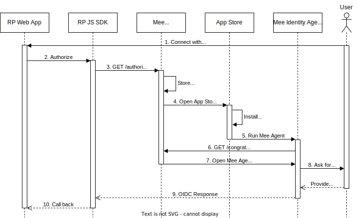

# Connect with Mee 

## Example: JS SDK

The agent can connect with a provider using a "Connect with Mee" button on the provider's app or website. Below is a sequnce diagram that shows the flowing involving a hypothetical website (ExampleProvider.org) that leverages the Mee JS SDK and the agent. 

