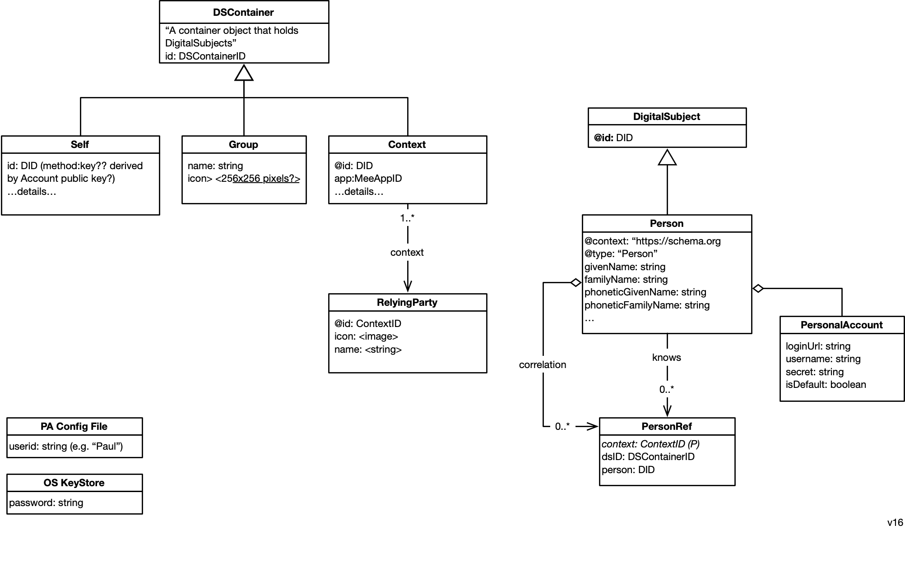

### Overview

This page describes the data model of the agent. This model is replicated across all instances of the user's agent running on different devices. At the highest level, the data model can be thought of as a 3 level hierarchy of data containers (DSContainer subclass instances):
* Self
  * Group
    * Context

The Self container holds a Person node that represents the [selfness](https://docs-dev.mee.foundation/Concepts.html#selfness-vs-whoness) of user as a single individual. The Self singleton is a data container containing a Person node representing the user. The Self has a set of Context container each of which represents how the user is presented to or perceived by a relying party (e.g. another person's agent or a digital service provider's website or app) (see [whoness](https://docs-dev.mee.foundation/Concepts.html#selfness-vs-whoness)). Note that more than one app may be involved in mediating the relationship with a single relying party. Each app manages its own Context instance. The Person node in the Self container has no scalar attributes but usually contains a set of N correlation links pointing to a corresponding Person node (representing the user) in each of N contexts.

Between the Self and the leaf Context containers may exist a set of Group containers. These intermediate containers also contain a Person node. This Person node is linked to "sub" Person nodes in the child containers of a Group container. It may also have attributes of its own. The Person node in a Group container can be used to represent a specific role a person might play in a set of child Contexts. 

Self-asserted Contexts contain information asserted by the user about themselves in a given context. 

Regular Contexts contain information that is input by the user, sensed or generated by an app that is "creating" this context. The data model of the information within the context is defined by the app developer. Wherever possible the develop should reuse existing ontologies, schemas, models, etc. And in any case the schema (to pick a term) should be defined by a URI.

### Container Classes

Here are the classes that define the various data containers. 

#### Sample Data

In the sample data shown below, a user, Alice, has two groups. The first group represents her role as a Journalist. It contains two contexts: the context of her relationship with Gmail and with Twitter. She plays a game for which there is a context (without being within a Group). The second group, entitled "News" contains only one context, her relationship with the NYTimes news site.

#### 

Data is read and/or written to these contexts by apps. For example the Game app reads and writes information about Alice as she plays the game to the Person entity shown in the 3rd context from the left. There may be more than one context associated with the connection (relationship) betwen Alice and a provider. In the example shown above, the NYTimes.com website reads and writes data to and from one context, but two other contexts also store information about Alice's overall connection with the NYTimes. We show a password manager and a form filler--two other apps that write to their corresponding contexts.

### Data Types

- **ContextID** - The digital space/realm/domain within which the user is interacting. 
- **MeeID** - Identifier of any kind of Digital Subject (i.e. entity) about which data is stored in the agent. 

- **MeeAppID** - A specific kind of MeeID. Uniquely identifies an app developer's app. A single, logical, MeeAppID is associated with one or more physical apps (usually on different platforms such as mobile, webapp, etc.) all of which that creates and manages the data contents of a Context a using the same schema. [We have to think through concurrent update issues in the case of N>1 physical apps]

- **Secret Recovery Phrase** - a 12-word textual phrase that the user creates. It is used to generate cryptographic keys that in turn are used to encrypt the user’s personal data whether it is stored locally on their device or in a backup location. It can be used to generate keys to digitally sign transactions (e.g., for crypto currency transactions). It should never be shared with anyone or any service provider. If the user loses this phrase, they lose the ability to decrypt their data. 

##### Keys

* **Account key pair** is the primary user account key pair.
* **PBKDF2 key** is a key generated by using user password. It’s needed to encrypt the user account private key.
* **User device key pair** is a key pair is generated and stored on the user device. Device private key can be used to encrypt the user account private key.
* **Client key pair** is key pair to identify client app or website
* **Context key** is a key to encrypt user data in the context.

#
[
Edit this page
](https://github.com/MeeProject/docs/edit/develop/src/Data.md)
