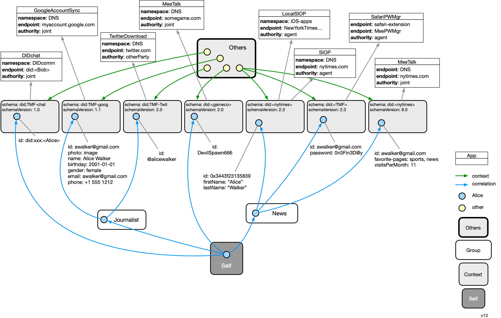

# Data Model

This page describes the data model of the agent. The user's data that follows this model is replicated across instances of their agent running on different devices. 

At the highest level, the data model can be thought of as a three level hierarchy of data containers (DSContainer subclass instances) each of which holds Person instances representing the user:

* Self
  * Group (optional)
    * Context

These Person instances are connected into a directed graph that spans these three levels of containers. The singleton Self container holds a single Person node that represents the [selfness](https://docs-dev.mee.foundation/Concepts.html#selfness-vs-whoness) of user as a single individual. The Self has a set of Context containers each of which represents how the user is presented to or perceived by an Other Party (e.g. another person's agent or a digital service provider's website or app) (see [whoness](https://docs-dev.mee.foundation/Concepts.html#selfness-vs-whoness)). Note that more than one app may be involved in mediating the relationship with a single other party. Each app manages its own Context instance. The Person node in the Self container has no scalar attributes but usually contains a set of N correlation links pointing to a corresponding Person node (representing the user) in each of N contexts.

Between the Self and the leaf Context containers may exist a set of intermediate level Group containers. These also contain a Person node. This Person node is linked to "sub" Person nodes in the child containers of a Group container. It may also have attributes of its own. The Person node in a Group container can be used to represent a specific role a person might play in a set of child Contexts. 

In the simplified example below we have a user, Alice, whose selfness is represented by a blue Person node in the Self context. Alice has a relationship with three other parties, an email provider, Twitter, and some game. Each of these relationships is represented by a context. The whoness facet of Alice that she exposes in each context is represented by a Person node in each of these three contexts.

The information in a context (most importantly person nodes) is managed by an app. The app writes data that may have been directly input by the user, may have been sensed by the app or may have otherwise been generated by the app. The data model of the information within the context is a developer-defined extension of the Persona data model. Wherever possible the developer should reuse existing ontologies, schemas, models, etc. 

## Container classes

Here are the various data container classes. 

- **Others** - a container holding a set of Other nodes (a subclass of DigitalSubject). Each Other each of which represents another parties with which the user is interacting via apps and websites. In other words the user has a computer-mediated relationship with each Other node--we call these relationships *Connections*. These Others may be other people or legal entities, often called relying parties, such as a digital service provider legal entity (e.g. Twitter, Inc.). 
- **Self** - the single container holding a single Person node that represents the selfness of the user
- **Group** - an intermediate level container that holds a single Person node that represents a common role or persona that the user plays. A group has these attributes:
  - **name** - the name of the group 
  - **icon** - a icon for the group
- **Context** - a container of one Person node representing the user in a specific aspect of their relationship with some other party. We say "specific aspect" because the relationship between the user a given other, may be represented by more than one context, each representing a different aspect. A context has the following attributes, that taken together uniquely identify the context:
  - **namespace** - endPoint name space - a string that indicates the namespace used by the "op" attribute
  - **endpoint** - other party endpoint - a string identifier that unique identifies the other party with which the user has a relationship within the opNS namespace
  - **schema** - a linke to the data schema (i.e. the classes of objects and kinds of inter-relationships) used by this context. All apps that manage the data of a context must have a matching dataSchema. 
  - **protocol**: a string value that identifies the networking protocol used to communicate with the other party

Instances of Context are managed by apps/sites. The Others, Self, Group and ContextCopy instances are entirely managed by the agent itself.

### Container example #1

In the example below, and starting at the bottom of the diagram that our example user, Alice, has defined groups for herself. The first group represents her role as a Journalist, and contains two contexts: the context representing her relationship with Google and with Twitter. The second group, entitled "News" contains only one context. It represents her one aspect of relationship with the NYTimes news site. She plays a game for which there is a context (without being within a Group), and she has a direct relationship with Bob using DIDComm.  

Data is read from and/or written to these contexts by apps shown at the top. For example the game app reads and writes information about Alice as she plays the game to the person entity shown in the 4th context from the left. There may be more than one context associated with a single connection between Alice and a provider's app or site. 

### Container example #2

This next example shows a more complex situation. Alice connected to a government website and from it obtained a set of attributes about herself.  She also connected to NYTimes.com website, which, as part of this connection, requested some information that is attested by this same government website. The agent creates a ContextCopy which points back to its source context. 

## Persona classes

The  types of containers that have been introduced (Self, Groups, Contexts, ContextCopies, and Others) all contain information about DigitalSubjects that are described according to the Persona data model. As mentioned above Context instances are read from and written to by apps/sites. 

**Core**

The mandatory, core part of the model that app/site developers must use is intentionally simple so as to constrain the app/site developer as little as possible. It specifies that people must be represented as instances of Person, that these Person instances are interconnected using *correlation* and *knows* relationships. A PersonalAccount class is also defined. These core classes are shown below. The attributes (e.g. givenName, etc.) shown in blue above are illustrative only and are not part of the core. 

**Constraints**

- All attribute types must have globally unique identifiers (and although recommended, these identifiers don't have to be resolveable to metadata about the attribute)

**Extentions to Persona core schema  (non-normative)**

[This section (to be written) will describe extentions to the core Persona schema]

## Datatypes

- **MeeID** - Identifier of any kind of Digital Subject (i.e. entity) about which data is stored in the agent. 
- **MeeAppID** - A specific kind of MeeID. Uniquely identifies a service provider's site or mobile app. A single, logical, MeeAppID is associated with one or more physical apps (usually on different platforms such as mobile, webapp, etc.) all of which that creates and manages the data contents of a Context a using the same schema. [We have to think through concurrent update issues in the case of N>1 physical apps]

- **Secret Recovery Phrase** - a 12-word textual phrase that the user creates. It is used to generate cryptographic keys that in turn are used to encrypt the user’s personal data whether it is stored locally on their device or in a backup location. It can be used to generate keys to digitally sign transactions (e.g., for crypto currency transactions). It should never be shared with anyone or any service provider. If the user loses this phrase, they lose the ability to decrypt their data. 

##### Keys

* **Account key pair** is the primary user account key pair.
* **PBKDF2 key** is a key generated by using user password. It’s needed to encrypt the user account private key.
* **User device key pair** is a key pair is generated and stored on the user device. Device private key can be used to encrypt the user account private key.
* **Client key pair** is key pair to identify client app or website
* **Context key** is a key to encrypt user data in the context.

#
[
Edit this page
](https://github.com/MeeProject/docs/edit/develop/src/Data.md)
