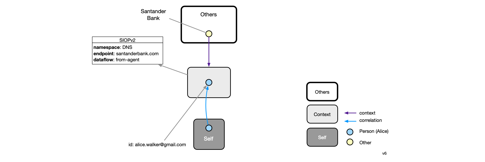
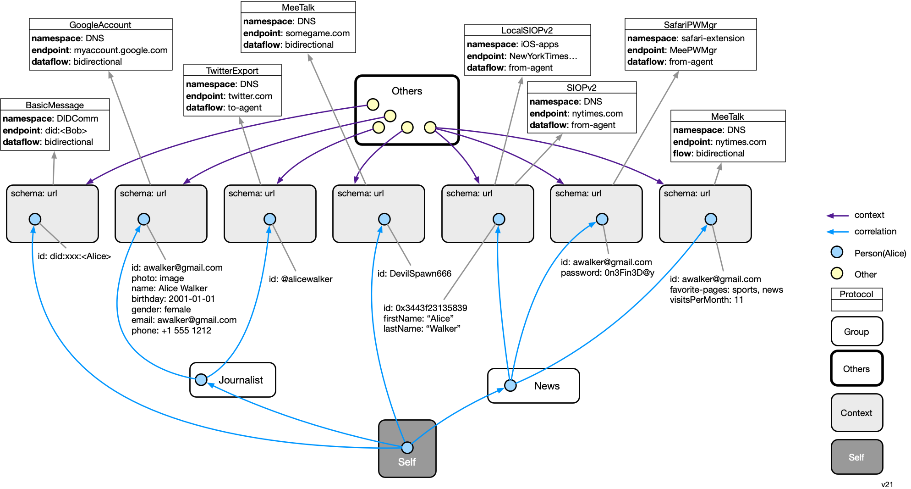
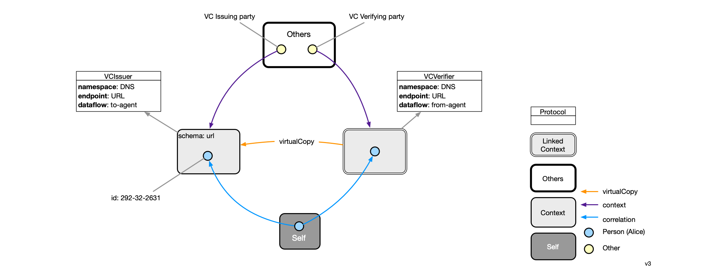
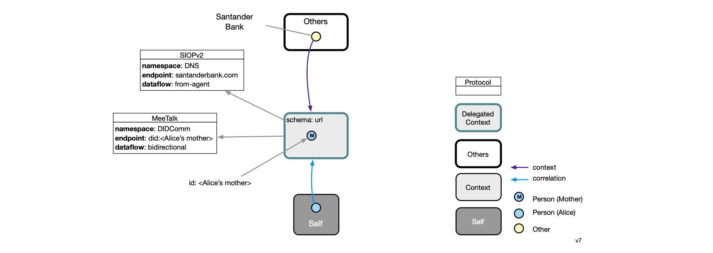

# Data Model

This page describes the data model of the agent. The user's data that follows this model is replicated across instances of their agent running on different devices. 

## Introduction

At the highest level, the data model can be thought of as a three level hierarchy of data containers (Container subclass instances) each of which holds Person instances representing the user:

* Self
  * Group
    * Context

These Person instances are connected into a directed graph that spans these three levels of containers. The singleton Self container holds a single Person node that represents the [selfness](https://docs-dev.mee.foundation/Concepts.html#selfness-vs-whoness) of user as a single individual. The Self has a set of Context containers each of which represents how the user is presented to or perceived by another party (e.g. another person's agent or a digital service provider's website or app) (see [whoness](https://docs-dev.mee.foundation/Concepts.html#selfness-vs-whoness)). Note that any number of combinations of communications protocols, local apps and web services may be involved in the connection between the agent and another party. The Person node in the Self container has no scalar attributes but usually contains a set of N correlation links pointing to a corresponding Person node (representing the user) in each of N contexts.

Between the Self and the leaf Context containers may exist a set of intermediate level Group containers. These also contain a Person node representing the user. This Person node is linked to "sub" Person nodes in the child containers of the Group container. It may also have attributes of its own. The Person node in a Group container can be used to represent a role the user might play in a set of child contexts. 

In the simplified example below we show a user, Alice, whose selfness is represented by a blue Person node in the Self context. Alice has a relationship with three other parties: a game, Twitter, and the New York Times. Each of these relationships is represented by a context. The whoness, or facet of Alice that she exposes in each context is represented by a Person node in each of these three contexts.

The information in a context (most importantly person nodes) is read and written to by the agent based on the data flowing through the agent's connection with the other party (or more precisely, with the apps and websites of the other party). We have added these other parties explicitly to the diagram below by introducing a new kind of context called Others within which are objects representing other parties. 

The personal data flowing through each of the three connections represented by the purple lines above may flow from the agent, to the agent or in both directions. It may have originated on either side. It may be self asserted claims (attributes) entered by the user directly into the agent. Or it may be claims entered by the user on a website of the other party, or sensed by a local app (or sensor), or generated by the other party based on direct on-site or on-app interactions with the user.

## Container classes

We describe the data model in two parts. The first part describes the data containers. The second describes the data that is held by those containers. Let us start describing the data model of the containers themselves. Here are the various data container classes: 

### **Classes**

- **Others** - a container holding a set of Other nodes (see Persona Classes). Each Other node represents a party with the user has a connection. These Others may be other people or legal entities. If they are legal entities, they are often called relying parties, such as a digital service provider like Twitter, Inc. Each other has the following properties:
  - context - a single Context that captures one aspect of the overall connection

- **Self** - the single Container holding a single Person node that represents the selfness of the user
- **Group** - an intermediate level container that holds a single Person node that represents a common role or persona that the user plays. A group has these attributes:
  - **name** - the name of the group 
  - **icon** - a icon for the group
- **Context** - a Container holding a Person node that represents the user in a specific aspect of their relationship with some other party. We say "specific aspect" because the relationship between the user a given other, may be represented by more than one context, each representing a different aspect. 

**More about Contexts**

A context has the following attributes, that taken together uniquely identify the context:

- schema - url of the schema of the data in the context
- protocols[] - array of one or more Protocol instances

The kinds of data held by a context depends on the communications protocol (using the term loosely) between the agent and the other party. As will be described next, a Protocol class within the agent represents these data conventions using a schema that is an extension of the Persona schema.

There are two subclasses of Context: LinkedContext and Delegated context that are described in their own sections below.

### Protocols

A Protocol class represents a communication protocol used between the agent and an endpoint provided by an other party. Each protocol subclass represents a different communications protocol such as SIOPv2, GoogleAccountSync, BasicMessage (DIDComm), etc.  Protocol classes have a class method that returns the data schema used when it updates data in that context. These schemas are resolvable from a URL which is written to the *schema* attribute of the Context instance.

A Protocol is an attribute of a Context, and although a less common situation, may have more than one. Below is an example of a user Alice who has a (hypothetical) connection with Santander Bank. This connection has a single context that contains the information that Alice shares in with the bank via the OpenID Connect SIOPv2 protocol.

Each protocol instance has these attributes:

- **namespace** - a string that indicates the namespace used by the "endpoint" attribute
- **endpoint** - a string identifier that unique identifies the other party with which the user has a relationship within the above namespace attribute
- **dataflow** - one of {to-agent, from-agent, bidirectional} - indicates the direction of data flow between the agent and the endpoint

### Multiple connections

In the example below, we expand our story about our user, Alice. She has defined two groups. The first represents her role as a Journalist, and it contains two contexts: the context representing her relationship with Google and with Twitter. The Google context contains her Google account profile which can be updated either using her agent or via the Google website (hence the "bidirectional" dataflow). Her Twitter context contains a snapshot of all of her Twitter account information, lists of who she follows, etc. 

The second group, entitled "News" contains a Person linked to three context all belowing to the New York Times. The first of these three is the context that she uses, via SIOPv2 to login to the NYTimes website. The second is a context that contains the password she used to use before she started logging in with SIOP. The last is a context that establishes a bidirectional connection with the NYTimes using a new (an purely hypothetical for now!) bidirectional data synchronization protocol called MeeTalk. She plays a game for which there is a context (without being within an intervening Group), and she has a direct relationship with her friend Bob using the DIDComm BasicMessage protocol.  

A relationship between the identity agent and another party is called a *connection*. It is represented by one or more other contexts each of which has a protocol (and sometimes more than one). Alice is shown with five connections--one for each of the five Other nodes in her Others container. 

### Linked contexts

Alice can convey claims made about her by one party and present them to another party. For this example we'll assume that the claims are encapsulated within a [Verifiable Credentials](https://www.w3.org/TR/vc-data-model/) document. 

In this example Alice, presumably having authenticated herself in her connection to a site/app of the "VC Issuing party" is issued a VC containing claims about her which is stored in the leftmost context above. She then goes to another site/app of the "VC Verifying party" and finds that they trust the issuing party and would accept a VC issued by them. In Alice's second connection a VC presenting protocol is used to send the VC to the verifying party. This second connection involved a special class of context, called a LinkedContext. 

### Delegated contexts

Alice takes care of her elderly mother, and helps her mother manage her bank account at Santander Bank. Alice's mother has an agent and has delegated access to Alice a context that contains her mother's OpenID Connect SIOP claims. 

As shown above, Alice has a direct connection with the bank (that communicates via the SIOPv2 protocol) but the context for that connection is linked to a context managed by Alice's mother's agent. The MeeTalk data replication/sync protocol is used to ensure that Alice's DelegatedContext is always synchronized with the "original" context on her Mother's agent.

## Persona classes

Group and Context containers all contain information about subjects (things) that are described according to the persona schema. [We need to decide on the Persona Schema Description Language (SDL) and describe the concepts below using it]. In knowledge representation parlance, the Persona schema would be known as an *upper ontology.*

In the Persona schema, people are be represented as instances of Person, A PersonalAccount class is also defined. These classes are shown below. 

### Classes

- **Subject** -  kind of digital subject about which the agent stores information
- **Person** - a natural person, a subclass of Subject. Each person has the following properties:
  - **claims** - a set of zero or more properties. Here are a few examples: 
    - givenName
    - familyName
    - phoneticGivenName
  - **account** - an optional PersonalAccount at some other party's site or app
  - **correlation** - zero or more PersonRefs that act as a link to a target Person object representing another whoness of the link's source's person's selfness.
  - **knows** - zero or more PersonRefs that link to a Person representing some other person (other than the user)
- **Other** - a Subject representing another person or a legal entity with which the user has a connection. Each Other object has:
  - **consents** - zero or more Consent objects. Each Consent has 
    - dateTime - time stamp of when the user consented to share this set of claims
    - claims[]  - a set of zero or more claims (note: claim types (e.g. "email address") not their values)

**Extensions**

Each protcol class will extend the Persona schema by defining Person subclasses, other new object classes and new kinds of relationships. For example the Google "myaccount" API includes (optional) claims of "name", "gender" and "birthday". The protocol that supports the myacount API would define these claim types in its schema, and insert a link to this schema in its corresponding context's *schema* attribute.

## Datatypes

This section is largely incomplete, but will eventually describe lower level classes that we call datatypes that are used by the higher level classes mentioned above.

- **EndpointId** -  an identifier of an endpoint (e.g. webservice or a local app) supported by an other party.
- **LocalAppId** - A specific kind of EndpointId. Uniquely identifies a service provider's mobile app. 

- **Secret Recovery Phrase** - a 12-word textual phrase that the user creates. It is used to generate cryptographic keys that in turn are used to encrypt the user’s personal data whether it is stored locally on their device or in a backup location. It can be used to generate keys to digitally sign transactions (e.g., for crypto currency transactions). It should never be shared with anyone or any service provider. If the user loses this phrase, they lose the ability to decrypt their data. 

##### Keys

* **Account key pair** is the primary user account key pair.
* **PBKDF2 key** is a key generated by using user password. It’s needed to encrypt the user account private key.
* **User device key pair** is a key pair is generated and stored on the user device. Device private key can be used to encrypt the user account private key.
* **Client key pair** is key pair to identify client app or website
* **Context key** is a key to encrypt user data in the context.

#
[
Edit this page
](https://github.com/MeeProject/docs/edit/develop/src/Data.md)
