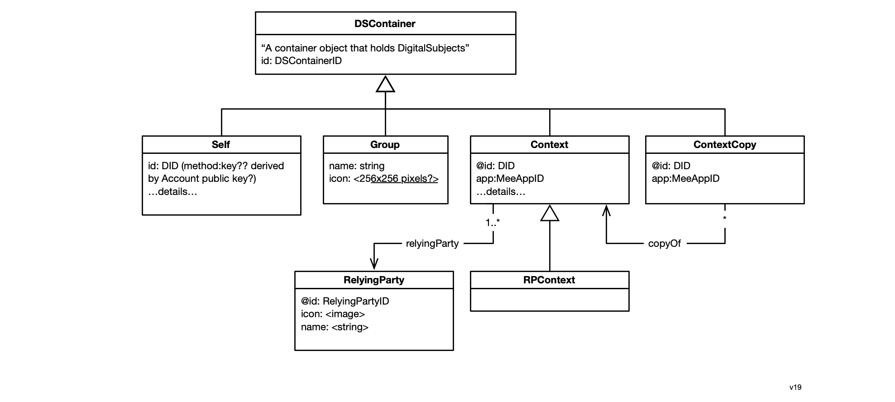
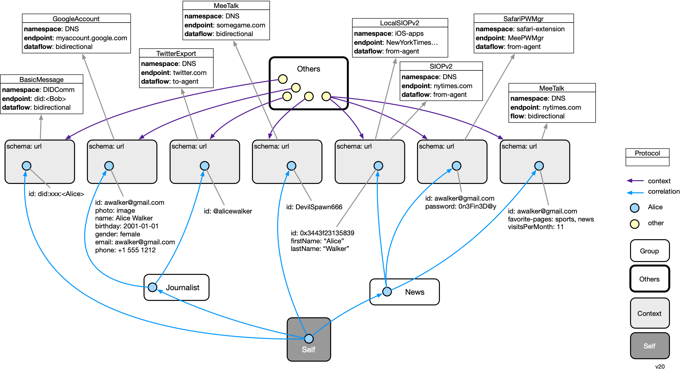
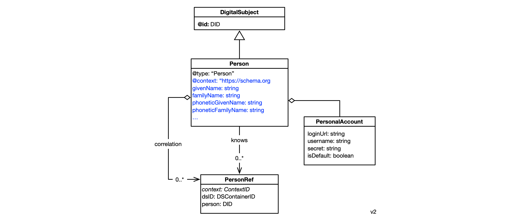

# Data Model

This page describes the data model of the agent. The user's data that follows this model is replicated across instances of their agent running on different devices. 

At the highest level, the data model can be thought of as a three level hierarchy of data containers (Container subclass instances) each of which holds Person instances representing the user:

* Self
  * Group (optional)
    * Context

These Person instances are connected into a directed graph that spans these three levels of containers. The singleton Self container holds a single Person node that represents the [selfness](https://docs-dev.mee.foundation/Concepts.html#selfness-vs-whoness) of user as a single individual. The Self has a set of Context containers each of which represents how the user is presented to or perceived by an Other Party (e.g. another person's agent or a digital service provider's website or app) (see [whoness](https://docs-dev.mee.foundation/Concepts.html#selfness-vs-whoness)). Note that more than one app may be involved in mediating the relationship with a single other party. Each app manages its own Context instance. The Person node in the Self container has no scalar attributes but usually contains a set of N correlation links pointing to a corresponding Person node (representing the user) in each of N contexts.

Between the Self and the leaf Context containers may exist a set of intermediate level Group containers. These also contain a Person node. This Person node is linked to "sub" Person nodes in the child containers of a Group container. It may also have attributes of its own. The Person node in a Group container can be used to represent a specific role a person might play in a set of child Contexts. 

In the simplified example below we have a user, Alice, whose selfness is represented by a blue Person node in the Self context. Alice has a relationship with three other parties, an email provider, Twitter, and some game. Each of these relationships is represented by a context. The whoness facet of Alice that she exposes in each context is represented by a Person node in each of these three contexts.

The information in a context (most importantly person nodes) is read and written to by the agent based on the agent's connection with some other party. We now add these other parties explicitly to the diagram. We introduce a new kind of context called Others within which are objects that represent each other party. 

The app writes data that may have been directly input by the user, may have been sensed by the app or may have otherwise been generated by the app. 

## Container classes

We describe the data model in two parts. The first part describes the data containers. The second describes the data that is held by those containers.

Here are the various data container classes. 

- **Others** - a container holding a set of Other nodes. Each Other represents another party with which the user is interacting via their agent's connections with local apps and websites. These Others may be other people or legal entities. These legal entities are often called relying parties, such as a digital service provider like Twitter, Inc.
- **Self** - the single Container holding a single Person node that represents the selfness of the user
- **Group** - an intermediate level container that holds a single Person node that represents a common role or persona that the user plays. A group has these attributes:
  - **name** - the name of the group 
  - **icon** - a icon for the group
- **Context** - a Container holding a Person node that represents the user in a specific aspect of their relationship with some other party. We say "specific aspect" because the relationship between the user a given other, may be represented by more than one context, each representing a different aspect. A context has the following attributes, that taken together uniquely identify the context:
  - schema - url of the schema of the data in the context
  - protocols[] - array of one or more Protocol instances

The data held by a context represents data conventions that are defined by the communications protocol (using the term loosely) between the agent and the other party. As will be described next, a Protocol class within the agent represents these data conventions the using a schema that is an extension of the Persona schema.

### Protocols

A Protocol class is a communication protocol used between the agent and an endpoint provided by an Other party. Each protocol subclass represents a different communications protocol such as SIOPv2, GoogleAccountSync, BasicMessage (DIDComm), etc.  Protocol classes have a class method that returns the data schema used when it updates a context. This schema is written to the "schema" attribute of the Context instance.

One (and in some cases more) instances of a Protocol are properties of a Context. Each instance has these attributes:

- **namespace** - a string that indicates the namespace used by the "endpoint" attribute
- **endpoint** - a string identifier that unique identifies the other party with which the user has a relationship within the above namespace attribute
- **dataflow** - one of {to-agent, from-agent, bidirectional} - indicates the directions of data flow between the agent and the endpoint

### Container example #1

In the example below, our example user, Alice, has defined two groups for herself. The first group represents her role as a Journalist, and contains two contexts: the context representing her relationship with Google and with Twitter. The second group, entitled "News" contains only one context. It represents her one aspect of relationship with the NYTimes news site. She plays a game for which there is a context (without being within a Group), and she has a direct relationship with Bob using DIDComm.  

A relationship between the identity agent and another party is called a *connection*. It is represented by one or more other contexts. In the diagram above, Alice has five connections--one for each of the five Other nodes in her Others container. The right-most connection between Alice and the New York Times involves three different protocols (SIOPv2, SafariPWMgr, and MeeTalk) whereas the others each only involve only one.

## Persona classes

Group and Context containers all contain information about subjects (things) that are described according to 

**Core**

The mandatory, core part of the model specifies that people must be represented as instances of Person, that these Person instances are interconnected using *correlation* and *knows* relationships. A PersonalAccount class is also defined. These core classes are shown below. The attributes (e.g. givenName, etc.) shown in blue above are illustrative only and are not part of the core. 

**Constraints**

- All attribute types must have globally unique identifiers (and although recommended, these identifiers don't have to be resolveable to metadata about the attribute)

**Extentions to Persona core schema  (non-normative)**

[This section (to be written) will describe extentions to the core Persona schema]

## Datatypes

- **EndpointId** -  an identifier of an endpoint (e.g. webservice or a local app) supported by an other party.
- **LocalAppID** - A specific kind of EndpointId. Uniquely identifies a service provider's mobile app. 

- **Secret Recovery Phrase** - a 12-word textual phrase that the user creates. It is used to generate cryptographic keys that in turn are used to encrypt the user’s personal data whether it is stored locally on their device or in a backup location. It can be used to generate keys to digitally sign transactions (e.g., for crypto currency transactions). It should never be shared with anyone or any service provider. If the user loses this phrase, they lose the ability to decrypt their data. 

##### Keys

* **Account key pair** is the primary user account key pair.
* **PBKDF2 key** is a key generated by using user password. It’s needed to encrypt the user account private key.
* **User device key pair** is a key pair is generated and stored on the user device. Device private key can be used to encrypt the user account private key.
* **Client key pair** is key pair to identify client app or website
* **Context key** is a key to encrypt user data in the context.

#
[
Edit this page
](https://github.com/MeeProject/docs/edit/develop/src/Data.md)
